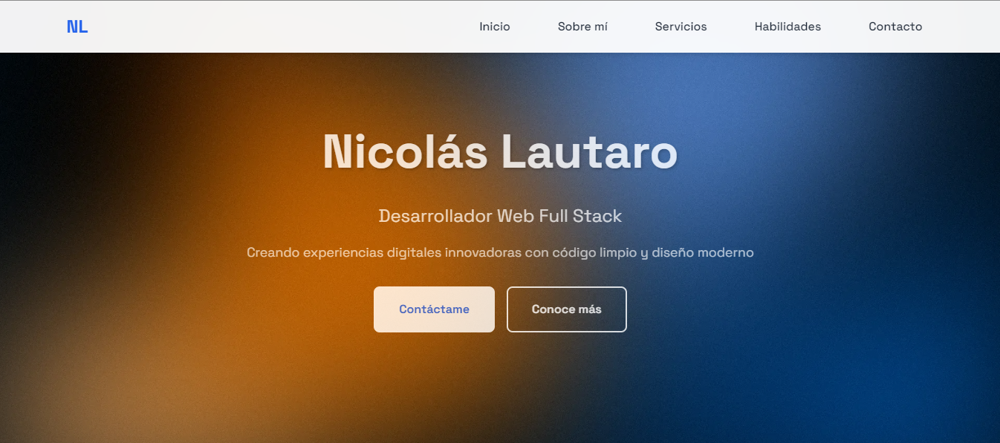
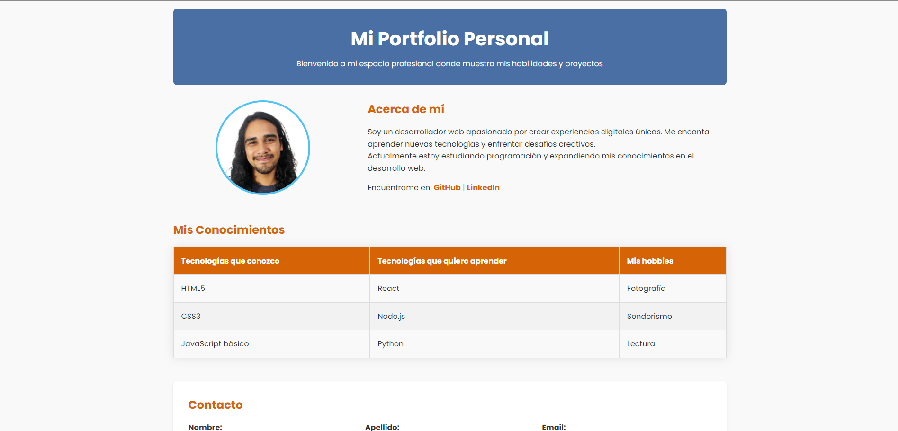

# Portfolio Personal - Nicolás Lautaro

Este proyecto es un portfolio web profesional desarrollado como parte de la **Práctica Formativa 2**. Representa una evolución completa del portfolio inicial, con mejoras significativas en diseño, contenido y funcionalidad.

---

## 🧩 Características Principales

### 📌 Contenido Mejorado

- Sección **"Sobre mí"** ampliada con descripción personal detallada  
- Sección **"¿Qué hago?"** con servicios profesionales organizados en *cards*  
- Mayor profundidad en la presentación de habilidades y experiencia  
- Información de contacto completa y profesional  

### 🛠 Tecnologías Utilizadas

- HTML5 con etiquetas semánticas  
- CSS3 con Flexbox para *layouts* responsivos  
- Google Fonts (Poppins) para tipografía moderna  
- Font Awesome para iconografía profesional  
- CSS Variables para mantenimiento eficiente del código  

---

## ⚙️ Características Técnicas Implementadas

### 🎨 Diseño y Layout

- ✅ Flexbox para todos los *layouts* principales  
- ✅ Unidades relativas (`%`, `vw`, `rem`) para contenedores  
- ✅ Box Model correctamente implementado con `margins`, `padding` y `borders`  
- ✅ Centrado de elementos con `flexbox` y `margin: 0 auto`  
- ✅ Navegación horizontal con lista sin *bullets*  

### 💅 Estilos Avanzados

- ✅ Pseudoclases completas para enlaces (`link`, `visited`, `hover`, `active`)  
- ✅ Tabla estilizada con `nth-child(even)` y `nth-child(odd)`  
- ✅ `Z-index` implementado en navegación y sección *hero*  
- ✅ Combinadores CSS (descendiente y directo)  
- ✅ Opacidad para efectos visuales y *overlays*  
- ✅ Iconos Font Awesome integrados en toda la interfaz  

### 📱 Responsividad Completa

- 📱 Tablet horizontal (`max-width: 1080px`)  
- 📱 Tablet vertical (`max-width: 768px`)  
- 📱 Mobile 1 (`max-width: 480px`)  
- 📱 Mobile 2 (`max-width: 375px`)  

---

## 🗂 Estructura del Proyecto

```
 portfolio/
 ├── index.html
 ├── README.md
 ├── css/
 │   └── styles.css
 └── assets/
     └── img/
         └── sample.png
```

---

## 🚀 Mejoras Implementadas

### 🧠 Contenido

- Descripción personal más extensa y profesional  
- Sección de servicios con iconografía  
- Tabla de habilidades categorizada  
- Formulario de contacto mejorado con más campos  
- Enlaces a redes sociales  

### 🎨 Diseño

- *Hero section* con gradiente y *overlay*  
- *Cards* con efectos *hover* y sombras  
- Navegación fija con *backdrop blur*  
- Animaciones y transiciones suaves  
- Paleta de colores profesional y consistente  

### 💻 Código

- Comentarios organizados por secciones  
- Variables CSS para fácil mantenimiento  
- Código limpio y bien indentado  
- Uso correcto de elementos semánticos HTML5  
- Optimización para diferentes dispositivos  

---

## 👀 Vista Previa

### Versión 2


### Versión 1


---

**Desarrollado con 💙 por Nicolás Lautaro - 2025**
